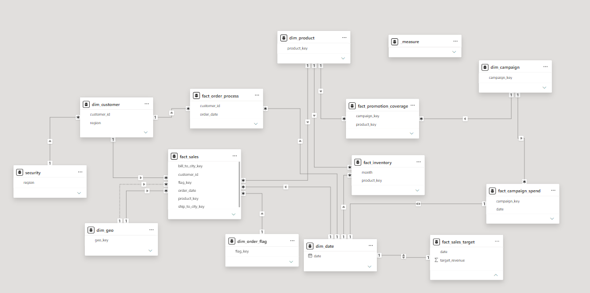
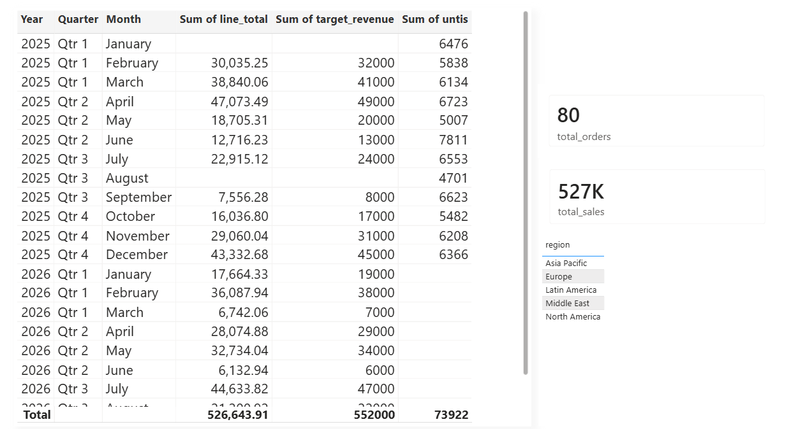

# Power BI Galaxy Schema — Sales, Campaign & Order Analytics

## Overview
This project models a retail/e-commerce business scenario in Power BI, covering sales performance, marketing campaign spend, inventory, and the order-to-payment lifecycle. It's built as a **galaxy schema** (multiple fact tables sharing conformed dimensions) rather than a single star schema, to reflect how a real analytics environment usually looks once more than one business process needs reporting.

## Data Model

**Dimensions (6):**
- `dim_customer`
- `dim_product`
- `dim_geo`
- `dim_campaign`
- `dim_order_flag`
- `dim_date`

**Facts (6):**
- `fact_sales`
- `fact_inventory`
- `fact_campaign_spend`
- `fact_promotion_coverage`
- `fact_order_process`
- `fact_sales_target`

### Key modeling decisions
- **Shared dimensions:** `dim_product` and `dim_campaign` are conformed across multiple fact tables, allowing cross-process analysis (e.g. product performance across both sales and promotions).
- **Role-playing dimension:** `dim_geo` is used twice — once for ship-to location, once for bill-to — via separate relationships/inactive relationships activated in DAX.
- **Accumulating snapshot fact:** `fact_order_process` tracks an order through its milestones (e.g. placed → shipped → paid), rather than logging one row per transaction event. This lets the model report on cycle time and stage-to-stage drop-off.
- **Dynamic Row-Level Security (RLS):** A security table maps signed-in user emails to region, filtering `dim_customer` so each user only sees their assigned region's data.

## DAX Measures
Five core measures live in a disconnected `_measures` table, keeping them separate from the data model for organization:
- `total_sales` — `SUM(fact_sales[line_total])` — total revenue across all sales
- `total_orders` — `DISTINCTCOUNT(fact_sales[order_id])` — count of unique orders
- `total_customers` — `COUNT(dim_customer[customer_id])` — total number of customers
- `total_active_customers` — `DISTINCTCOUNT(fact_sales[customer_id])` — count of distinct customers who have placed an order
- `average_order_to_pay` — `AVERAGE(fact_order_process[order_to_pay])` — average time (days) from order placement to payment, using the accumulating snapshot fact

## Report Pages
- **Page 1** — Consolidated single-page report: sales/target/inventory by Year/Quarter/Month, plus KPI cards for total sales, total orders, active/total customers, and average order-to-pay time. Includes a PulseChart custom visual.

## Screenshots

## Tools
- Power BI Desktop
- DAX
- Data modeling (star/galaxy schema design, RLS)

## Source
Built while following [Data With Baraa's](https://www.youtube.com/watch?v=0A2k62YEbfI) Power BI data modeling course, extended with dynamic RLS and an accumulating snapshot fact table.
